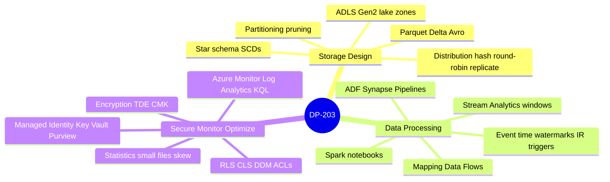
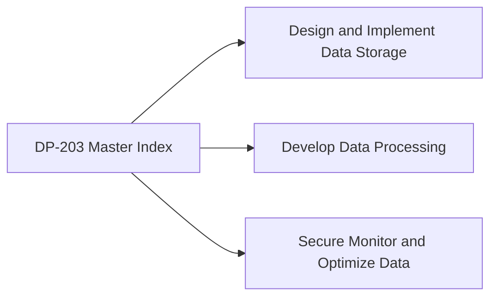
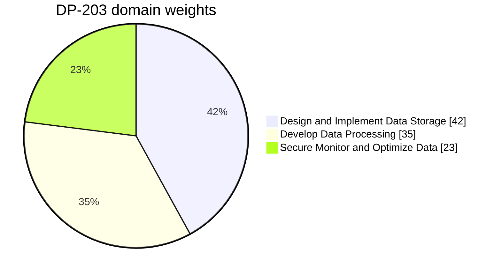

# DP-203 - Data Engineering on Microsoft Azure Associate - Visual Study Guide

> Concept-only study aid. No exam questions reproduced. Source PDF (if any) stays local + gitignored.

**Skills outline:** https://learn.microsoft.com/credentials/certifications/resources/study-guides/dp-203

## Concept mindmap

## Domain map

## Domain weights

> Click a slice / legend label to jump to that chapter.

## Recommended study order

```mermaid
gantt
    title Suggested study plan
    dateFormat X
    axisFormat Day %d
    section Plan
    Design and Implement Data Storage :t1, 0, 2d
    Develop Data Processing :t2, after t1, 2d
    Secure Monitor and Optimize Data :t3, after t2, 1d
```

---

**Next:** open [01-design-implement-storage.md](01-design-implement-storage.md)

<!-- TODO: fill remaining sections via Copilot chat. Target structure mirrors c:\az305\study-guide\00-MASTER-INDEX.md. -->
