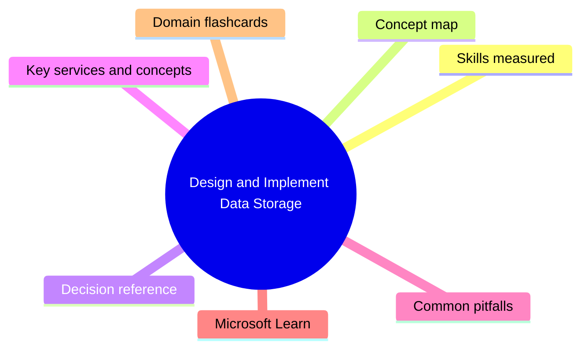

# Design and Implement Data Storage

**Domain weight on the exam:** ~42% (for DP-203).


## Domain mind map



## Skills measured

- Design a data storage structure: choose store type (lake/warehouse/db), design files for analytical workload (Parquet/Delta/Avro), folder partitioning, design a serving layer.
- Design a partition strategy: for files, analytical workloads (Synapse SQL pools, Spark), efficiency/performance, partition pruning.
- Design the serving layer: star schemas, slowly changing dimensions (Type 1/2/3/6), dimensional hierarchies, temporal data, granular vs aggregate fact, metadata.
- Implement physical data storage structures: compression, partitioning, sharding, distribution (hash, round-robin, replicate), data redundancy (LRS/ZRS/GRS), archive.
- Implement logical data structures: temporal data, slowly changing dimensions, hierarchy, external tables, dimensional hierarchies for analytical workloads.
- Implement the serving layer: star schemas, dimensional hierarchy, data sharing.

## Concept map

```mermaid
flowchart TD
  LakeVsWarehouse[Design and Implement Data Storage]
  LakeVsWarehouse --> Formats[Parquet (columnar) / Delta (ACID lake) / Avro (row, streaming)]
  LakeVsWarehouse --> Partitioning[By date/region/category; helps pruning]
  LakeVsWarehouse --> Distribution[Hash / Round-robin / Replicate]
  LakeVsWarehouse --> SCDs[Type 1 overwrite, Type 2 history, Type 6 hybrid]
```

## Decision reference

| Use this | When |
| --- | --- |
| **ADLS Gen2** | HDFS-compatible namespace, lake storage, hierarchical, ACLs |
| **Dedicated SQL pool (Synapse)** | MPP data warehouse, predictable workload, large scale |
| **Serverless SQL pool** | Pay-per-query over lake data; ad-hoc exploration |
| **Synapse Spark pool** | Big-data Spark over lake |
| **Fabric / OneLake** | Successor pattern - unified lake + lakehouse + warehouse |
| **Parquet** | Analytics columnar - default for OLAP |
| **Delta / Delta Lake** | Parquet + transaction log; ACID + upsert |
| **Avro** | Row-based, schema-aware - good for streaming (Event Hubs Capture) |
| **Hash distribution** | Large fact tables - parallelize on a high-cardinality column |
| **Round-robin** | Staging tables - even but no co-located join |
| **Replicate** | Small dimensions ( <2GB ) - broadcast to all nodes |
| **Type 1 SCD** | Overwrite - no history kept |
| **Type 2 SCD** | New row per change - full history (effective dates / flag) |
| **Type 6 SCD** | Type 1 + Type 2 hybrid |

## Key services and concepts

| Name | Role |
| --- | --- |
| **Azure Data Lake Storage Gen2** | HDFS hierarchical store on Blob |
| **Azure Synapse Analytics** | Unified workspace: dedicated SQL, serverless SQL, Spark |
| **Dedicated SQL pool** | MPP T-SQL warehouse |
| **Serverless SQL pool** | Pay-per-query SQL over lake |
| **Synapse Spark** | Managed Spark in Synapse |
| **Cosmos DB** | Multi-model NoSQL; for OLTP/document/graph |
| **Azure SQL Database / MI** | Relational PaaS |
| **Microsoft Fabric / OneLake** | Lakehouse SaaS - successor pattern |
| **Parquet** | Columnar file format |
| **Delta Lake** | Open table format on Parquet with ACID |
| **Avro** | Row-based schema-aware format |
| **Distribution (hash/round-robin/replicate)** | Dedicated SQL pool data placement strategy |
| **Partitions (Synapse SQL)** | Range partitioning by column |
| **External tables (PolyBase / OPENROWSET)** | Query lake files as tables |
| **Materialized views** | Pre-computed query results, auto-refreshed |

## Common pitfalls

- Choosing dedicated SQL pool for tiny workloads - pay-while-paused 24/7.
- Using round-robin for large fact - cross-node joins kill perf; use hash on join key.
- Partitioning by low-cardinality column - skew + small file problem.
- Many small files in the lake - massive query overhead; compact to Parquet/Delta.
- Type 2 SCD without effective dates + current flag - history unusable.
- Storing PII in the lake without ACLs/encryption.

## Microsoft Learn

- [Introduction to Azure Synapse Analytics](https://learn.microsoft.com/training/modules/introduction-azure-synapse-analytics/)
- [Design and implement a data warehouse with Synapse](https://learn.microsoft.com/training/paths/implement-data-warehouse-azure-synapse/)
- [Work with Data Lake Storage Gen2](https://learn.microsoft.com/training/paths/data-engineer-azure-data-lake-storage/)
- [Delta Lake on Azure Synapse Spark pools](https://learn.microsoft.com/azure/synapse-analytics/spark/apache-spark-delta-lake-overview)

## Domain flashcards

<section class="fc-section" data-fc-title="Design and Implement Data Storage quick-fire">
<div class="flashcard-grid">
<div class="flashcard"><div class="fc-q">Q: When pick serverless over dedicated SQL pool?</div><div class="fc-a">A: Ad-hoc, low/intermittent usage; pay only per query. Dedicated = steady-state warehouse.</div></div>
<div class="flashcard"><div class="fc-q">Q: Hash distribution best when?</div><div class="fc-a">A: Large fact tables joining on high-cardinality columns.</div></div>
<div class="flashcard"><div class="fc-q">Q: Round-robin best for?</div><div class="fc-a">A: Staging/loading tables - even but no co-location.</div></div>
<div class="flashcard"><div class="fc-q">Q: Replicate best for?</div><div class="fc-a">A: Small dimensions (<2GB) - copied to every compute node.</div></div>
<div class="flashcard"><div class="fc-q">Q: Type 2 SCD vs Type 1?</div><div class="fc-a">A: Type 2 keeps history (new row per change); Type 1 overwrites.</div></div>
<div class="flashcard"><div class="fc-q">Q: Why Parquet for analytics?</div><div class="fc-a">A: Columnar + compressed + predicate pushdown - much faster column scans.</div></div>
<div class="flashcard"><div class="fc-q">Q: What is Delta Lake?</div><div class="fc-a">A: Parquet + transaction log = ACID, upserts, time travel on data lake.</div></div>
</div>
</section>
