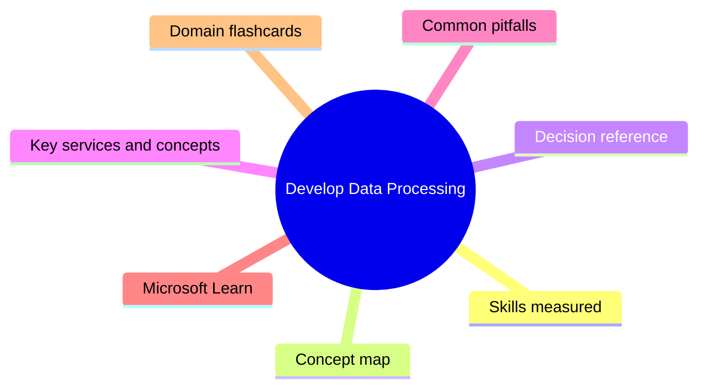
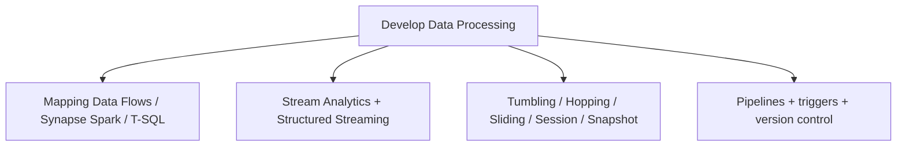

# Develop Data Processing

**Domain weight on the exam:** ~35% (for DP-203).

## Domain mind map

## Skills measured

- Ingest and transform data: design and implement incremental loads, batch processing (Synapse, ADF, Mapping Data Flows, Spark), stream processing (Stream Analytics, Spark Structured Streaming, Event Hubs).
- Develop a batch processing solution: Synapse, ADF, Synapse Spark/SQL, Spark Notebooks; transform using Spark/SQL/T-SQL, configure batch retention, handle late-arriving data, upsert, regress to handle data error.
- Develop a stream processing solution: Stream Analytics queries, windowing (tumbling/hopping/sliding/session/snapshot), event time vs processing time, schedule and trigger.
- Manage batches and pipelines: schedule pipelines, configure version control, integrate Jupyter/Python notebooks, handle pipeline errors and retries.

## Concept map

## Decision reference

| Use this | When |
| --- | --- |
| **Tumbling window** | Fixed, non-overlapping intervals (e.g., 5-min totals) |
| **Hopping window** | Fixed size with hop period (overlapping) |
| **Sliding window** | Output only when event occurs (continuous slide) |
| **Session window** | Activity grouped by gaps (user sessions) |
| **Snapshot window** | Group events with the same timestamp |
| **Event time** | Timestamp from event source |
| **Processing time** | Wall-clock at processor |
| **Mapping Data Flows** | Visual GUI ETL backed by Spark - no code |
| **Spark notebooks** | Code-first (PySpark/Scala) - max flexibility |
| **Synapse Pipelines / ADF** | Orchestration + activities (copy, dataflow, notebook, stored proc) |
| **Stream Analytics** | SQL-like streaming over Event Hubs/IoT Hub |
| **Structured Streaming (Spark)** | Streaming DataFrames - code, more control |
| **Trigger types** | Schedule / Tumbling / Event / Manual |

## Key services and concepts

| Name | Role |
| --- | --- |
| **Azure Data Factory (ADF)** | Hybrid orchestration + ELT |
| **Synapse Pipelines** | Same engine as ADF inside Synapse workspace |
| **Mapping Data Flows** | Visual ETL transformations - Spark under hood |
| **Synapse Spark pool** | Managed Spark |
| **Azure Stream Analytics** | Real-time SQL-style streaming |
| **Event Hubs** | High-throughput event ingestion |
| **IoT Hub** | Device telemetry ingestion + control |
| **Azure Databricks** | Premium Spark (often used here too) |
| **Triggers** | Schedule / tumbling / event / manual |
| **Window types** | Tumbling/Hopping/Sliding/Session/Snapshot |
| **Integration Runtime** | Compute for ADF/Synapse pipelines - Azure / Self-hosted / Azure-SSIS |
| **Git integration** | Source control for ADF/Synapse - GitHub / Azure DevOps |

## Common pitfalls

- Using processing time when event time matters - late events miscounted.
- Choosing hopping windows where tumbling would do - duplicate outputs.
- Forgetting watermarks - late events drift the result indefinitely.
- Mixing schema-on-read vs schema-on-write without alignment - downstream breaks.
- Putting all logic in pipelines instead of notebooks - hard to test.
- Not enabling Git integration for ADF/Synapse - no change history.

## Microsoft Learn

- [Build data integration pipelines (ADF)](https://learn.microsoft.com/training/paths/data-integration-scale-azure-data-factory/)
- [Transform data with Spark in Synapse](https://learn.microsoft.com/training/paths/perform-data-engineering-azure-synapse-apache-spark-pools/)
- [Real-time data processing in Azure](https://learn.microsoft.com/training/paths/implement-data-streaming-with-asa/)
- [Use mapping data flows in ADF/Synapse](https://learn.microsoft.com/training/modules/data-integration-azure-data-factory/)

## Domain flashcards

<section class="fc-section" data-fc-title="Develop Data Processing quick-fire">

Q: Tumbling vs hopping window?

A: Tumbling = non-overlapping fixed intervals. Hopping = fixed size with hop period (overlapping).

Q: Event time vs processing time?

A: Event time from event itself; processing time at processor. Event time correct for analytics.

Q: When use Stream Analytics over Spark Structured Streaming?

A: SQL-like simple streaming, low-code, integrated with Event Hubs. Spark for complex transforms / ML.

Q: Mapping Data Flows engine?

A: Spark cluster managed for you by ADF/Synapse.

Q: Integration Runtime types?

A: Azure (cloud), Self-hosted (on-prem), Azure-SSIS.

Q: How handle late-arriving stream events?

A: Watermarks + allowed lateness on the window.

</section>
