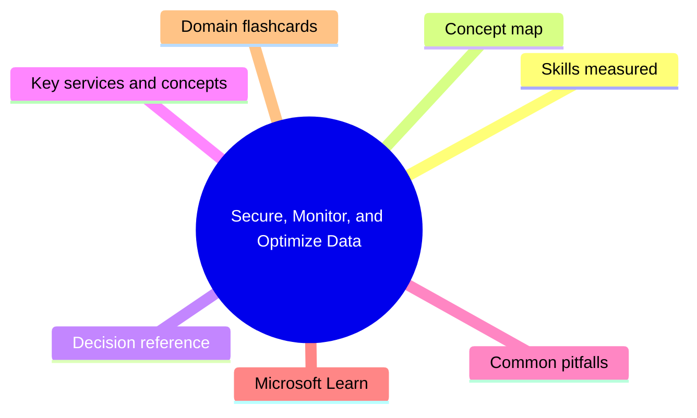
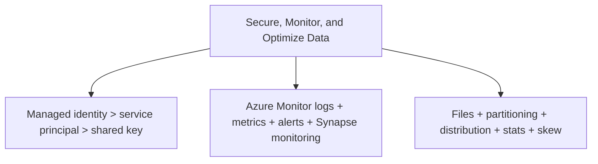

# Secure, Monitor, and Optimize Data

**Domain weight on the exam:** ~23% (for DP-203).

## Domain mind map

## Skills measured

- Implement data security: data masking, encryption (TDE, customer-managed keys), implement RBAC and ACLs on data lake, row/column-level security, data classification with Microsoft Purview, manage identities (managed identities, service principals).
- Monitor data storage and processing: monitor pipelines, query performance, cluster performance; configure Azure Monitor logs/metrics; analyze and optimize pipelines.
- Optimize and troubleshoot: handle small file problems, optimize file format / partitioning / distribution, handle data skew, rewrite poor T-SQL/Spark queries, manage statistics.

## Concept map

## Decision reference

| Use this | When |
| --- | --- |
| **TDE** | Transparent Data Encryption - default for Azure SQL/Synapse |
| **CMK** | Customer-managed keys via Key Vault - rotation control |
| **Dynamic data masking** | Mask sensitive cols at query time for unprivileged roles |
| **Row-level security** | Predicate function in security policy on table |
| **Column-level security** | GRANT SELECT on specific columns only |
| **ADLS ACLs** | POSIX ACL on path/files - granular access |
| **Managed identity** | Preferred for service-to-service auth - no secret |
| **Service principal** | Use when MI not supported |
| **Storage SAS token** | Short-lived, scoped - never long-lived keys |
| **Purview classification** | Auto-discover + classify sensitive data |

## Key services and concepts

| Name | Role |
| --- | --- |
| **TDE** | Encrypt at rest at SQL level |
| **Key Vault + CMK** | Customer-managed key management |
| **Dynamic Data Masking** | Per-role masking at query time |
| **Row-Level Security (RLS)** | Predicate-based row filtering |
| **Column-Level Security** | GRANT on columns |
| **ADLS ACLs / RBAC** | Granular permission on lake |
| **Managed Identity** | Auth without secrets |
| **Microsoft Purview** | Data catalog + classification + lineage |
| **Azure Monitor** | Logs + metrics + alerts |
| **Log Analytics** | KQL queries over Azure Monitor logs |
| **Synapse monitoring** | Built-in pipeline/SQL/Spark monitoring panel |
| **Query Store / DMVs** | Performance diagnostics in dedicated SQL pool |
| **Spark UI / event logs** | Diagnostics for Spark jobs |

## Common pitfalls

- Storing long-lived storage account keys instead of MI/SAS - rotation nightmare + breach risk.
- Using DDM as 'security' - it's display masking, easy to bypass with deduction queries.
- ACLs without RBAC at container level - default-deny without proper inheritance.
- Not collecting Azure Monitor logs for Synapse - blind to slow pipelines.
- Forgetting to UPDATE STATISTICS in dedicated SQL pool after big loads.
- Letting many small files accumulate - Spark/SQL scans get destroyed; compact regularly.

## Microsoft Learn

- [Secure your Azure resources](https://learn.microsoft.com/training/paths/secure-your-cloud-data/)
- [Manage and monitor Azure Synapse Analytics](https://learn.microsoft.com/training/modules/monitor-optimize-azure-synapse-analytics/)
- [Optimize Synapse SQL pool workloads](https://learn.microsoft.com/azure/synapse-analytics/sql-data-warehouse/sql-data-warehouse-best-practices)
- [Purview data governance](https://learn.microsoft.com/training/paths/microsoft-purview-data-governance/)

## Domain flashcards

<section class="fc-section" data-fc-title="Secure, Monitor, and Optimize Data quick-fire">

Q: Managed identity vs service principal?

A: MI has no secret to manage and is tied to the resource lifecycle. SP requires secret/cert mgmt. Prefer MI.

Q: TDE encrypts what?

A: Data at rest at the SQL data + log + backup level - transparent to queries.

Q: RLS vs CLS?

A: RLS filters which rows you see (security predicate). CLS controls which columns you can SELECT.

Q: Why compact small files in the lake?

A: Each file has open/scan overhead - many small files destroys Spark/SQL perf.

Q: Where statistics live in dedicated SQL pool?

A: Per-table; updated automatically but UPDATE STATISTICS after bulk loads to keep current.

Q: Purview job-to-be-done?

A: Catalog + classify + trace lineage of data assets across estate.

</section>
