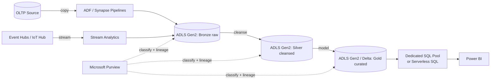

# Reference architectures (DP-203)

A canonical wire-up of the major services.

```mermaid
flowchart LR
  src1[(OLTP Source)] -->|copy| pipe[ADF / Synapse Pipelines]
  src2[Event Hubs / IoT Hub] -->|stream| asa[Stream Analytics]
  pipe --> bronze[(ADLS Gen2: Bronze raw)]
  asa --> bronze
  bronze -->|cleanse| silver[(ADLS Gen2: Silver cleansed)]
  silver -->|model| gold[(ADLS Gen2 / Delta: Gold curated)]
  gold --> sqlpool[Dedicated SQL Pool<br/>or Serverless SQL]
  sqlpool --> bi[Power BI]
  purview[Microsoft Purview] -.classify + lineage.-> bronze
  purview -.classify + lineage.-> silver
  purview -.classify + lineage.-> gold
```
